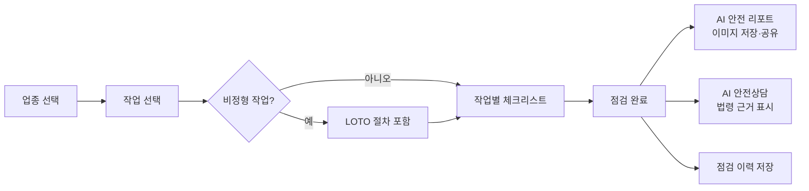

# 오늘의안전 (Today's Safety)

[](https://github.com/yeonskimm/safety/actions/workflows/test.yml)

안전관리 인력이 부족한 **소규모·취약 사업장**의 현장 작업자가, 설치 없이 휴대폰 브라우저만으로 **작업 전 안전점검**을 마치고 **법령 근거가 붙은 AI 안전상담**까지 받을 수 있는 웹앱(PWA)입니다.

- 실행: **https://yeonskimm.github.io/safety/**
- 설치 없이 바로 사용하며, 홈 화면에 앱으로 추가할 수 있습니다.
- 현재 버전: **v97**

---

## 1. 만든 이유

| 현장의 어려움 | 오늘의안전의 방식 |
|---|---|
| 전담 안전관리자가 없어 "오늘 이 작업에서 무엇을 확인할지" 작업자가 스스로 판단해야 함 | 업종 → 작업 → 체크리스트 3단계만 고르면 그 작업에 맞는 점검항목이 자동 구성됨 |
| 종이 점검표는 업종·작업 구분이 없어 현장에서 잘 쓰이지 않음 | 13개 업종, 86개 작업, 440개 점검항목. 사고 위험이 큰 핵심 항목은 '중요'로 표시하고 미확인 개수를 경고 |
| 수리·청소 같은 비정형 작업에서 끼임 사고가 반복됨 | 비정형 작업 선택 시 전원 차단·잠금·표지(LOTO) 절차를 점검항목에 자동 포함 |
| 법령이 어렵고, 일반 AI는 조문을 지어내는 경우가 있음 | 법령 원문 DB에서 찾은 조문만 AI에 넣고, 답변의 조문번호를 다시 검증 |
| 외국인 근로자가 한국어 점검표를 이해하기 어려움 | 전체 화면 한/영 전환 |

---

## 2. 주요 기능

| 기능 | 설명 |
|---|---|
| 맞춤 체크리스트 | 업종·작업 선택 시 해당 작업의 점검항목 자동 구성. 핵심 항목은 '중요' 표시 |
| 비정형 작업 LOTO | 수리·청소 등 비정형 작업에 전원 차단·잠금·표지 절차 안내 |
| AI 안전 리포트 | 점검 결과를 바탕으로 안전·주의·위험 판정 리포트 생성(핵심 항목 미확인 시 위험), 이미지 저장·공유 |
| AI 안전상담 | 산업안전보건법령 기반 질의응답. 실제 주입된 조문을 근거 칩으로 표시 |
| 한/영 이중언어 | 외국인 근로자를 위한 전체 화면 영문 전환 |
| 체감온도·폭염 단계 | 기상청 공식 산식 기반 체감온도 계산 및 단계별 조치 안내 |
| 점검 이력 | 최근 200건 기기 내 보관, 달력으로 날짜별 조회 |
| 오프라인 동작 | 네트워크가 없어도 체크리스트 이용 가능 |

### 이용 흐름



---

## 3. 생성형 AI 활용 방식 — 법령 검색(RAG)

AI가 법 조항을 지어내지 않도록 3단계로 방어합니다.

1. **검색** — 질문에서 키워드·동의어를 뽑아 법령 DB(`law_kb.json`)에서 관련 조문을 항(項) 단위로 추출
2. **주입** — 추출된 조문 원문만 AI에 넣고, 적용 요건·단서(예: "처음 발생한 재해")를 별도로 명시해 요약 중 누락을 방지
3. **검증** — 생성된 답변에 주입하지 않은 조문번호가 있으면 표기를 제거하고 확인 안내를 붙임

화면의 `📖 법령 근거` 칩은 **AI가 쓴 문장이 아니라 검색엔진이 실제로 주입한 조문 목록**입니다.
법령 DB를 불러오지 못하면 법 조항 질문에는 답하지 않습니다(근거 없는 법률 답변 차단).
DB에 없는 법(중대재해처벌법 등)을 물으면 단정하지 않고 국가법령정보센터 확인을 안내합니다.

### 법령 DB

| 법령 | 적용 원문 (시행일) | 조문 수 |
|---|---|---|
| 산업안전보건법 | 법률 제21374호 (2026.6.1) | 184 |
| 산업안전보건법 시행령 | 대통령령 제36540호 (2026.8.1) | 125 |
| 산업안전보건법 시행규칙 | 고용노동부령 제477호 (2026.8.1) | 252 |
| 산업안전보건기준에 관한 규칙 | 고용노동부령 제454호 (2025.12.1) | 669 |
| **합계** | | **1,230** (+ 별표 13종 350청크) |

- 조문은 국가법령정보센터(법제처 Open API) 원문 기준이며, **빌드일 현재 시행 중인 조문**만 넣습니다.
- 🔔 다음 갱신: **2026.12.8** — 법률 제21534호(근로감독관 → 노동감독관 명칭 변경 등) 시행일

---

## 4. 품질 관리

모든 배포 전에 자동 검사를 거치며, `main`에 올릴 때마다 GitHub Actions가 같은 검사를 다시 실행합니다(상단 `tests` 배지).

```bash
bash tests/run_all.sh    # 실패 시 종료코드 1
```

- 법령 검색 회귀 테스트 58문항 / 답변 조문번호 검증 19항목
- 법령 DB 구조 검증 — 오분할·부칙 혼입·본문 잘림·중복 조번호
- 관리자 인증 / AI 프록시 보호 통합 테스트
- 앱·캐시·법령 DB 버전 동기화, 평문 비밀값 잔존 검사
- 실제 브라우저 렌더링·개인정보 안내 테스트 (Playwright)

---

## 5. 운영·확산이 쉬운 구조

- **설치·서버 구축 불필요** — 정적 웹페이지 + 서버리스 프록시 구조라 별도 서버 없이 운영
- **점검항목 추가가 쉬움** — 업종·작업·점검항목이 한 곳의 목록으로 관리되어, 목록에 항목을 추가하는 방식으로 업종·작업을 늘릴 수 있음
- **법령 개정 대응** — 빌드 도구(`tools/`)로 법령 원문에서 DB를 다시 생성해 개정 사항을 반영
- **소스 공개** — 전체 코드와 검사 도구가 이 저장소에 있음

---

## 6. 개발 방식

- 감독관이 기획, 업종·작업별 점검항목 선정, 법령 원문 대조·검수를 맡고, 생성형 AI(Claude)를 활용해 앱 코드·법령 DB 가공·자동 검사를 작성했습니다.
- 앱 안의 AI 기능(리포트·상담)은 Groq(`openai/gpt-oss-120b`, 폴백 Google Gemini)를 사용합니다.

---

## 7. 구조 (유지관리용)

```
[브라우저 PWA]                  [Cloudflare Worker]           [외부 API]
 index.html          ─ HTTPS ─▶  safety-ai-proxy  ────────▶  Groq (gpt-oss-120b)
 service-worker.js                · 법령 RAG 검색              └ 실패 시 Gemini 폴백
 manifest.json                    · 프롬프트 구성             Open-Meteo / wttr.in
 (GitHub Pages)                   · 답변 조문 검증            BigDataCloud
                                  · 이용통계 (KV)
        law_kb.json ────────────▶
        (법령 1,230조문)
```

- **API 키는 앱에 없습니다.** 모든 외부 호출은 Worker를 경유하며, 허용된 출처에서만 요청을 받습니다.
- 관리자 인증은 서버에서 검증하고 세션 토큰을 발급합니다. 앱 코드에 비밀번호가 없습니다.
- AI 시스템 프롬프트는 서버에 고정되어 있어 앱 밖에서 역할을 바꿀 수 없고, IP당 요청 한도와 답변 길이 상한을 서버에서 적용합니다.
- 프레임워크 없이 단일 HTML 파일로 만든 이유: 현장 단말의 네트워크가 불안정한 경우가 많아 **첫 로딩에 추가 요청이 없는 구조**가 필요했기 때문입니다.

### 파일 구조

```
index.html          앱 본체 (단일 파일 — HTML/CSS/JS 일체)
service-worker.js   오프라인 캐시
manifest.json       홈 화면 앱 설정
law_kb.json         법령 검색 DB
worker.js           Cloudflare Worker (AI 프록시 · RAG · 통계 · 관리자)
tools/              법령 DB 빌드 도구
  hwpx_extract.py      별표 HWPX -> 텍스트
  build_annex.py       별표 청크 생성
  build_kb.py          law_kb.json 빌드
  validate_kb.py       빌드 결과 검증 (본문 잘림 검사 포함)
  build_kb_from_md.py  법제처 원문으로 조문 전체 재생성 — 법령 개정 시 사용
  restore_articles.py  특정 조문만 원문으로 교체
tests/              배포 전 자동 검사 (run_all.sh 외)
.github/workflows/  자동 검사 (test.yml)
```

- 법령 개정 시: `build_kb_from_md.py` → `validate_kb.py` → `tests/run_all.sh`, 이후 `worker.js`의 `LAW_KB_VER`와 KB `meta.빌드버전`을 함께 올립니다.
- 별표 추가 시: `hwpx_extract.py` → `build_annex.py` → `build_kb.py` → `validate_kb.py`

---

## 8. 개인정보 처리

- 점검 이력·설정은 **이용자 기기에만** 저장되며 서버로 전송되지 않습니다.
- 서버에는 익명 이용통계와, 이용자가 직접 남긴 의견·연락처(180일 후 자동 삭제)만 저장됩니다. 연락처는 수집·이용 동의를 받은 경우에만 받습니다.
- 정확한 위치 좌표는 저장하지 않습니다. 날씨 조회에만 사용하며, 통계에는 **시·군·구 수준 지역과 기기 종류(iOS/Android)만** 집계합니다.
- 방문 분석에 Google Analytics를 사용합니다.
- AI 입력 내용은 답변 생성을 위해 외부 AI 서비스로 전송됩니다. 입력창 위에 개인정보 입력 자제 안내를 표시하고, 서버 로그에 질문 원문을 남기지 않습니다.

---

## 9. 주요 개선 이력

| 버전 | 내용 |
|---|---|
| v97 | 오프라인 캐시 정리 범위를 이 앱으로 한정 |
| v96 | 법령 DB 전면 재생성(2026.8.1 시행 개정 반영), AI 프록시 보호, 개인정보 안내 |
| v95 | 법령 검색 정확도 개선, 답변에 근거 조문 칩 표시, GitHub Actions 자동 검사 도입 |
| v94 | 관리자 인증 서버 이전, 항 단위 조문 주입, 답변 조문번호 검증 |
| v92 | AI 모델 교체(`openai/gpt-oss-120b`) |

버전별 상세 내역은 [CHANGELOG.md](CHANGELOG.md)를 참고하세요.

---

## 10. 유의사항 · 문의

> ⚠️ 이 앱의 안내는 참고용입니다. 법적 효력이 있는 해석은 국가법령정보센터(law.go.kr) 또는 관할 고용노동청에서 확인하십시오.

오류 신고 및 개선 제안은 앱 내 `사용자 의견` 기능을 이용해 주십시오.

---

대구지방고용노동청 광역산재예방감독과 · 근로감독관용 법령·적용기준 확인 앱은 [법ON](https://github.com/yeonskimm/lawon)을 참고하세요.
